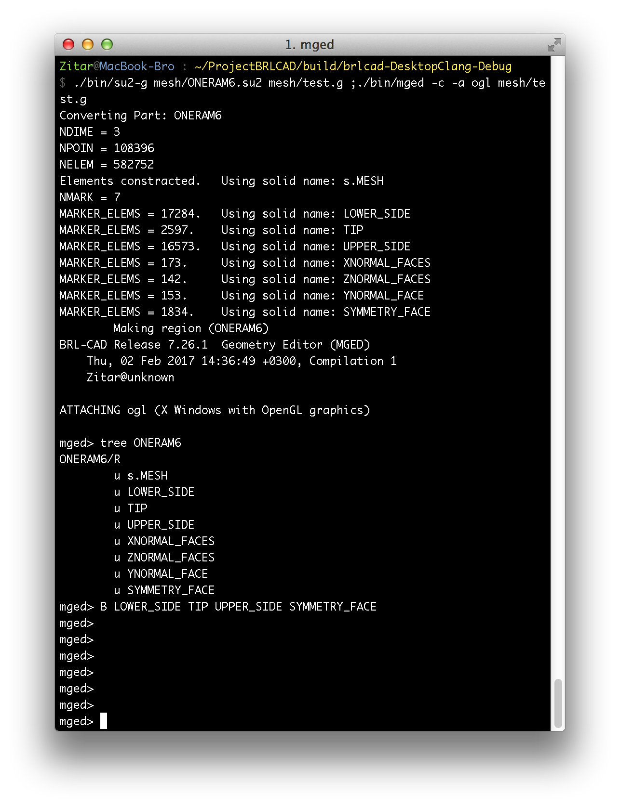
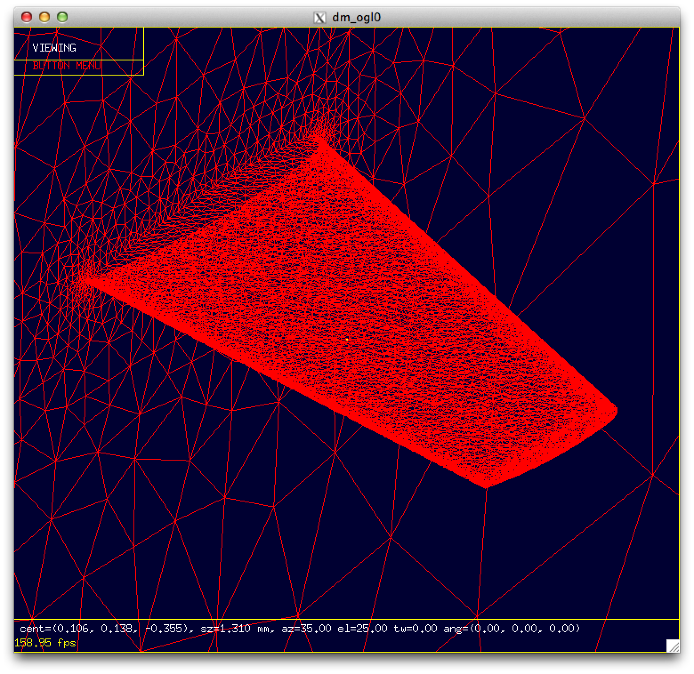

Hi,
Over hear you will see the attpets(s) I make to integrate SU2 into BRL-CAD.
Right now, importing/exporting .su2 mesh files are done.

Next I will try to add configuration auto generation to make a study.

Demo:
Command Line           |  Mesh File
:-------------------------:|:-------------------------:
  |  
